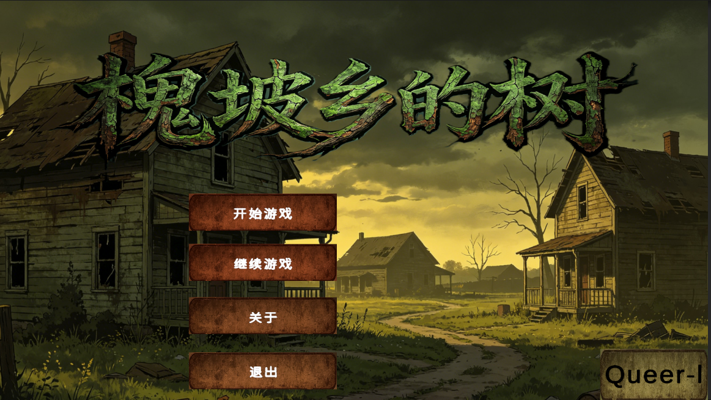
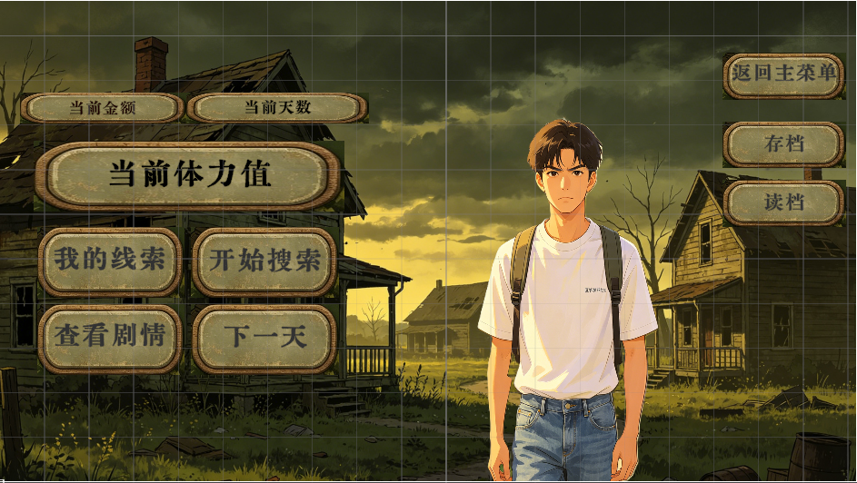
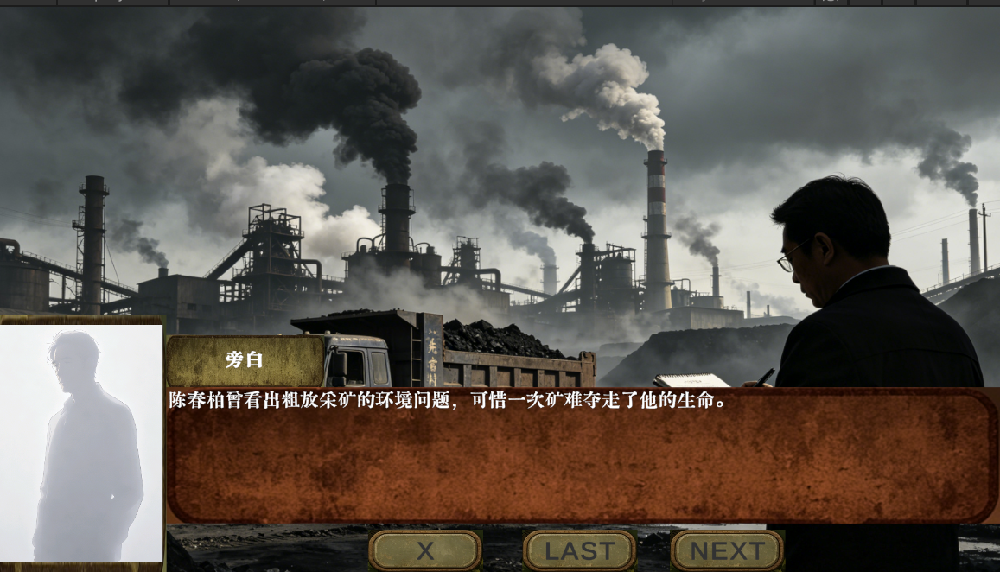
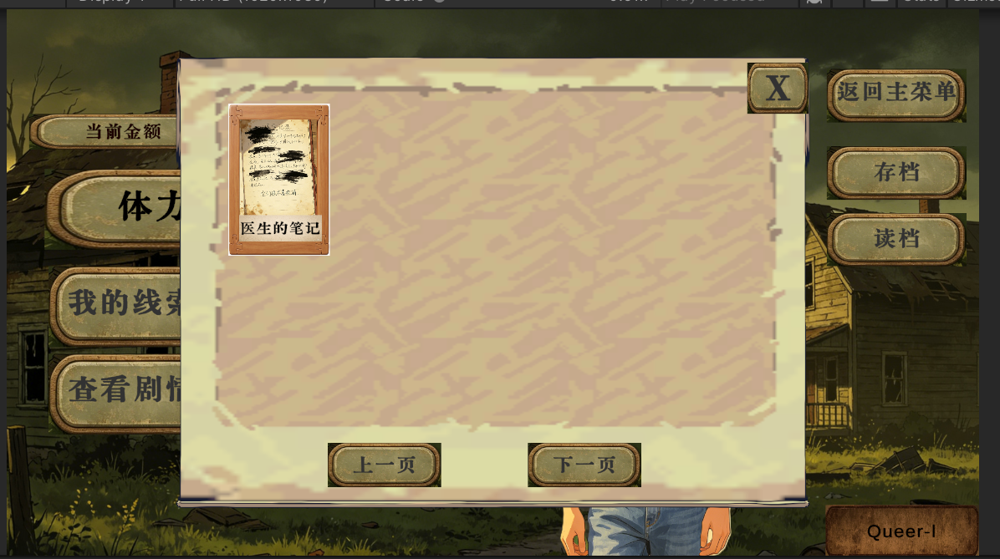
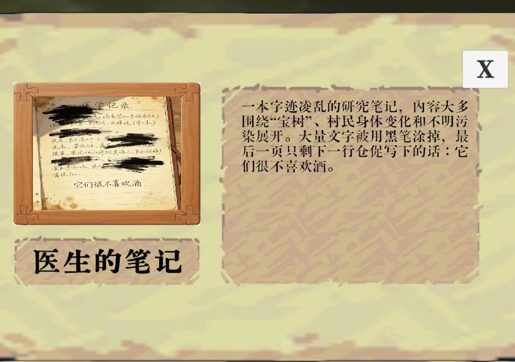
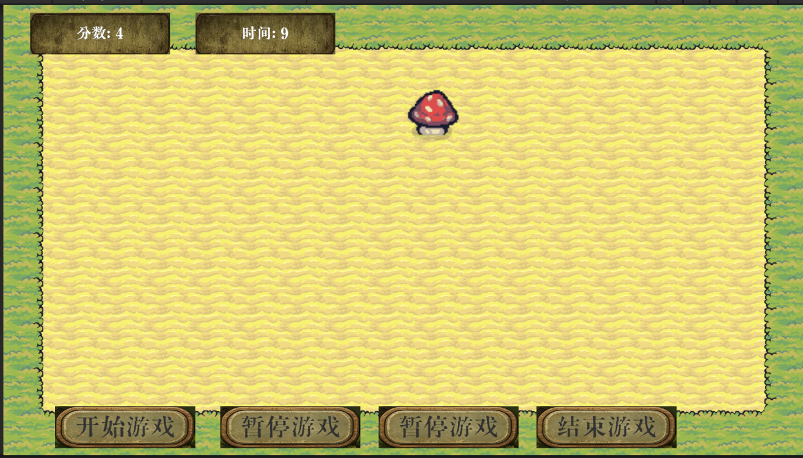
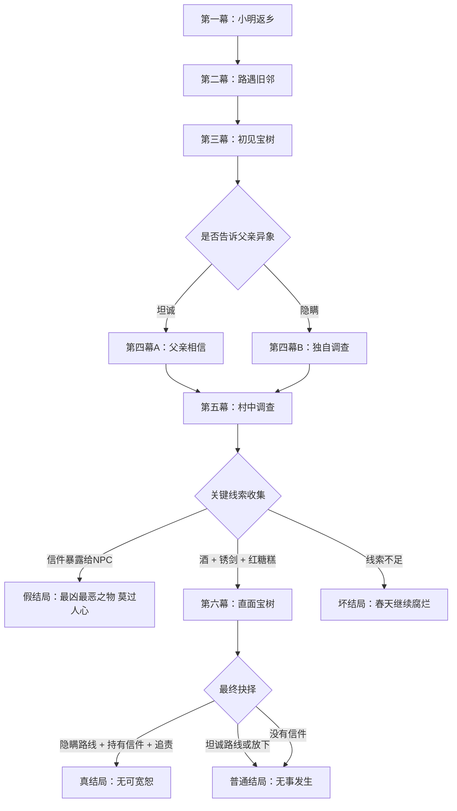

# TheTreeCollage

> **树影之下，罪业难藏。** 一款基于 Unity 2D 的剧情驱动型冒险解谜游戏。

医学院研究生**小明**在暑假回到阔别已久的家乡槐坡乡，惊讶地发现久病缠身的父母竟奇迹般恢复了健康——这一切都源于村口那棵能"治病"的**宝树**。随着调查的深入，一桩被掩埋二十年的矿难、一封写给已故同乡的信，以及一个超越认知极限的古老存在，逐渐浮出水面……

游戏包含多分支剧情、体力调查系统和打地鼠小游戏，玩家的每一个选择都会把故事推向不同的结局。

## 游戏截图

| 初始界面 | 主界面 | 剧情界面 |
|:---:|:---:|:---:|
|  |  |  |

| 线索背包 | 线索详情 | 打地鼠小游戏 |
|:---:|:---:|:---:|
|  |  |  |

## 剧情梗概

- **第一幕 · 小明返乡**：小明发现患病的父母恢复健康，得知"宝树"结果。
- **第二幕 · 路遇旧邻**：父子的旧邻大多面色红润、身体强健，同时交代槐坡乡"先富村"的煤矿背景与陈家的悲剧。
- **第三幕 · 初见宝树**：小明直面超越认知极限的"宝树"，昏迷苏醒后触发第一次关键抉择——是否告诉父亲自己所见的异象。
- **第四幕**：根据抉择进入**坦诚**（父亲相信小明）或**隐瞒**（独自调查）两条路线。
- **第五幕 · 村中调查**：在村中自由调查，收集道具、与 NPC 对话，逐步拼凑真相。
- **第六幕 · 直面宝树**：大决战，道具的收集情况决定能否削弱古神。
- **第七幕 · 尾声**：拿着信件与父亲对峙，做出最终抉择。

## 剧情走向图



## 游戏玩法

- **剧情推进**：通过顺序对话和分支选择推进故事，玩家的选择会影响剧情走向和最终结局。
- **调查与线索**：消耗体力进行调查行动，解锁线索。线索可用于解锁后续分支选项，也可在最终对决中决定胜负。
- **体力与天数系统**：每天拥有 3 点体力上限，调查、获取线索、进入下一天均消耗体力。进入下一天后体力自动恢复。
- **打地鼠小游戏**：通过小游戏获取分数和额外线索奖励，支持简单/困难两种难度。
- **多结局**：根据玩家选择，剧情走向**真结局**、**普通结局**、**坏结局**或**假结局**。

## 主要角色

| 编号 | 角色 | 说明 |
|------|------|------|
| 0 | 小明 | 主角，医学院研究生 |
| 1 | 父亲 | 小明的父亲，与矿难真相有着隐秘关联 |
| 2 | 母亲 | 小明的母亲 |
| 3 | 陈爷爷/陈工 | 村中长者，曾是矿上的高级工程师 |
| 4 | 陈奶奶 | 村中长者，陈春柏的母亲 |
| 5 | 陈春柏 | 陈家人，二十年前死于矿难的大学生 |
| 6 | 高中历史老师 | 提供槐坡乡的历史背景 |
| 7 | 卫生所年轻医生 | 为小明提供帮助 |
| 8 | 疯疯癫癫的道士 | 神秘人物，知晓丹药与锈剑的来历 |
| 9 | 村民群像 | 村庄的集体声音 |
| 10 | 旁白 | 叙述者 |
| 11 | 树神/古神 | 核心神秘角色 |

## 线索与道具

游戏共设计 12 件线索/道具，由 `ClueSO` 配置，是解锁分支、推进主线和决定结局的关键。

| ID | 名称 | 是否关键 | 主要用途 |
|---:|---|---|:---|
| 1 | 宝树果实 | 是 | 宝树信仰与污染真相的核心象征线索 |
| 2 | 大白兔奶糖 | 否 | 父亲关心小明的日常道具，强化家庭线 |
| 3 | 水井里的锈剑 | 是 | 最终对决中斩开宝树枝叶，需配合酒使用 |
| 4 | 一把铜钥匙 | 是 | 打开老道观，获取丹药并进入道士相关线索 |
| 5 | 一把铁钥匙 | 是 | 打开卫生所后门，获取医生笔记 |
| 6 | 不知名丹药 | 否 | 道观线索，误用会导向坏结局 |
| 7 | 医生的笔记 | 是 | 提示"它们很不喜欢酒"，解锁医生给药分支 |
| 8 | 一瓶酒 | 是 | 最终对决削弱宝树致幻影响 |
| 9 | 一瓶药 | 否 | 医生给出的无标签药物，制造不可信选择 |
| 10 | 揉皱的小广告 | 否 | 强化民间骗术、"神药"叙事与村中氛围 |
| 11 | 一封信 | 是 | 最终对峙核心证据，暴露给 NPC 会进入假结局 |
| 12 | 红糖糕 | 是 | 唤起宝树/陈春柏相关记忆，最终对决关键道具 |

## 结局一览

| 结局 | 触发条件 | 内容 |
|------|----------|------|
| **真结局 · 无可宽恕** | 第三幕选择隐瞒 + 持有信件 + 最终选择追责 | 小明劝父亲自首，罪业终被清算 |
| **普通结局 · 无事发生** | 坦诚路线、选择放下，或未找到信件 | 太阳照常升起，一切如旧 |
| **坏结局 · 春天继续腐烂** | 关键道具不足或做出错误选择 | 小明被宝树吞噬 |
| **假结局 · 最凶最恶之物，莫过人心** | 将信件暴露给 NPC | 引发人心线结局 |

## 技术架构

### 核心技术

- **引擎**：Unity 2022.3+ (2D 模板)
- **语言**：C#
- **UI 框架**：UGUI + TextMeshPro
- **数据存储**：JSON 本地存档（3 个存档位）

### 主要系统

| 系统 | 核心脚本 | 功能 |
|------|----------|------|
| 剧情系统 | `StoryManager`, `StoryNodeSO` | 管理分支对话、角色立绘、CG 展示、前后对话导航 |
| 线索系统 | `ClueManager`, `ClueSO`, `ClueSlot`, `ClueInfoUI` | 线索收集、展示、条件判断 |
| 玩家数据 | `PlayerData` | 单例运行时数据（体力、天数、剧情进度、存档读档） |
| 日流程 | `DayManager`, `PlayerManager` | 体力消耗、调查行动、天数推进 |
| 小游戏 | `WhackGameController`, `WhackTarget`, `WhackGameConfigSO`, `WhackSettlementUI` | 打地鼠玩法、难度配置、分数奖励、结算界面 |
| 主菜单 | `MainMenuManager`, `SaveSelectUI` | 新游戏、读档、关于我们 |
| UI 控制 | `UIControl` | 通用弹窗/面板打开关闭管理 |
| 编辑器工具 | `StoryNodeSOGeneratorWindow`, `StoryNodeDesignImporter`, `ClueSOGeneratorWindow` | 批量生成剧情节点和线索资产 |

### 项目结构

```
Assets/
├── 脚本/
│   ├── Editor/          # 编辑器扩展工具
│   ├── Item/            # 线索系统（ClueSO, ClueManager, ClueSlot）
│   ├── LittleGame/      # 打地鼠小游戏
│   ├── Player/          # 玩家数据与日流程
│   ├── UI/              # 主菜单、剧情、线索 UI 管理
│   └── 剧情线/          # 剧情节点 ScriptableObject 定义
├── Prefabs/             # UI 预制体（按钮、物品槽、小游戏 UI、可点击调查物）
├── SOS/                 # ScriptableObject 剧情数据资产
│   ├── 剧情so/          # 剧情节点资产
│   ├── 线索SO/          # 线索/道具资产
│   └── 小游戏配置/      # 打地鼠难度与奖励配置
└── Scenes/              # 游戏场景（MainMenu、GameScene、LittleGame）
```

### 存档系统

- 存档格式：JSON 文件
- 存档位置：`Application.persistentDataPath`
- 存档槽位：3 个（`1.json`, `2.json`, `3.json`）
- 存档内容：体力、天数、分数、已解锁线索、剧情进度、剧情历史、分支标记

## 快速开始

1. 使用 Unity Hub 打开项目（需要 Unity 2022.3 或更高版本）
2. 在 Unity 中打开 `MainMenu` 场景
3. 点击 Play 运行游戏
4. 在主菜单中选择"开始游戏"或"读取存档"

## 剧情编辑

项目提供了编辑器工具用于快速创建剧情内容：

- **StoryNodeSO 生成器**：在 `Assets > Create > Game > Story Node` 创建剧情节点资产
- **ClueSO 生成器**：在 `Assets > Create > Game > ClueSO` 创建线索资产
- **设计文档导入器**：通过 `Tools > Generate Story Nodes From Design`，直接解析设计文档中的 Markdown 表格并批量生成剧情节点
- 剧情节点通过 `nodeID` 串联，支持顺序跳转（`nextNodeID`）和分支跳转（`choices`）
- 分支选项可配置**线索条件**（`requiredClue`）和**剧情标记条件**（`requiredFlag`），实现条件分支
- 节点可配置**线索奖励**（`rewardClue`）、**进入标记**（`flagOnEnter`）和**结局标记**（`isEnding` / `endingType`）

更详细的设计文档位于 [`游戏信息/`](游戏信息/) 目录，包括剧情、系统介绍、道具设计与具体节点设计。
