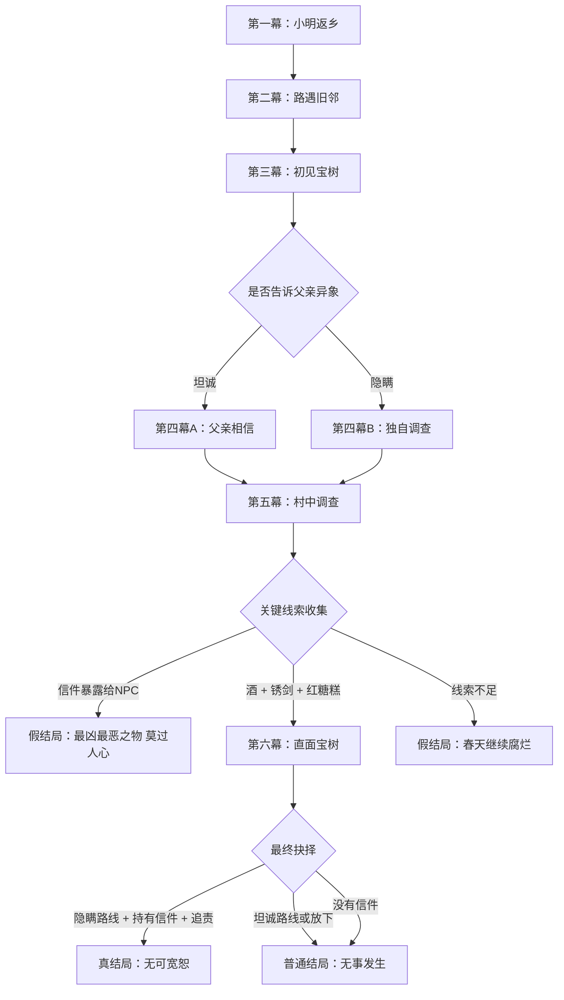

# 剧情走向图

```mermaid
flowchart TD
    A[第一幕：小明返乡] --> B[第二幕：路遇旧邻]
    B --> C[第三幕：初见宝树]
    C --> D{是否告诉父亲异象}
    D -->|坦诚| E[第四幕A：父亲相信]
    D -->|隐瞒| F[第四幕B：独自调查]
    E --> G[第五幕：村中调查]
    F --> G
    G --> H{关键线索收集}
    H -->|信件暴露给NPC| X[假结局：最凶最恶之物 莫过人心]
    H -->|酒 + 锈剑 + 红糖糕| I[第六幕：直面宝树]
    H -->|线索不足| Y[假结局：春天继续腐烂]
    I --> J{最终抉择}
    J -->|隐瞒路线 + 持有信件 + 追责| T[真结局：无可宽恕]
    J -->|坦诚路线或放下| N[普通结局：无事发生]
    J -->|没有信件| N
```
